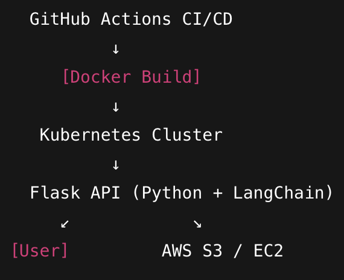

# Medical Assistant AI Chatbot

AI-powered medical assistant built with LangChain, OpenAI, and Pinecone, deployed on AWS via Docker with CI/CD through GitHub Actions.

## Tech Stack

- **Python** – Core language
- **Flask** – Backend / front-end server
- **LangChain** – Orchestration of LLM workflows
- **Pinecone** – Vector store for embeddings
- **OpenAI** – LLM provider
- **Docker** – Containerization
- **AWS** – Hosting (ECR, EC2)
- **GitHub Actions** – CI/CD pipeline
- **(Optional)** React – If frontend is extended beyond Flask templates


## Architecture Overview

<p align="center">
  
</p>

## Prerequisites

- Git
- Conda (or Python 3.10+ environment manager)
- Docker (for containerized runs)
- AWS account with permissions to use ECR and EC2
- Pinecone account & API key
- OpenAI API key

## Local Development

### 1. Clone the repository

```bash```
git clone https://github.com/miluskapajuelo/Medical-Assistant-AI-Langchain-AWS.git
cd Medical-Assistant-AI-Langchain-AWS

## Create and activate environment

```bash```
conda create -n medicalchatbot python=3.10 -y
conda activate medicalchatbot

(If you prefer venv instead of conda:)

python -m venv .venv
source .venv/bin/activate  # macOS/Linux
.venv\Scripts\activate     # Windows


## 3. Install dependencies

pip install -r requirements.txt


## 4. Configure environment variables

PINECONE_API_KEY="your_pinecone_api_key_here"
OPENAI_API_KEY="your_openai_api_key_here"
PINECONE_ENVIRONMENT="us-east1-gcp"  # adjust if needed
PINECONE_INDEX_NAME="your_index_name"


## 5. Initialize / store embeddings
python store_index.py

python app.py

http://localhost:8000


# AWS CI/CD & Deployment Overview

## 1. Login to AWS console.
## 2. Create IAM user for deployment

#with specific access

1. EC2 access : It is virtual machine

2. ECR: Elastic Container registry to save your docker image in aws


#Description: About the deployment

1. Build docker image of the source code

2. Push your docker image to ECR

3. Launch Your EC2 

4. Pull Your image from ECR in EC2

5. Lauch your docker image in EC2

#Policy:

1. AmazonEC2ContainerRegistryFullAccess

2. AmazonEC2FullAccess

## 3. Create ECR repo to store/save docker image

- Save the URI: 009160065334.dkr.ecr.us-east-2.amazonaws.com/medicalbot

## 4. Create EC2 machine (Ubuntu)
## 5. Open EC2 and Install docker in EC2 Machine:


#optinal

sudo apt-get update -y

sudo apt-get upgrade

#required

curl -fsSL https://get.docker.com -o get-docker.sh

sudo sh get-docker.sh

sudo usermod -aG docker ubuntu

newgrp docker


## 6. Configure EC2 as self-hosted runner:
setting>actions>runner>new self hosted runner> choose os> then run command one by one

